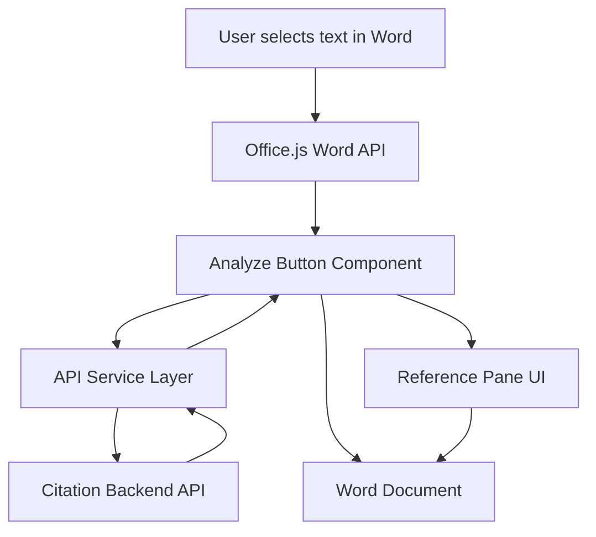

# Word Citation Add-in

## Overview

This project implements a Microsoft Word add-in that automatically generates citations for selected text using a backend citation analysis service.

Users can highlight text within a Word document and press **Analyze** to:

1. Send the selected text to a citation analysis API.
2. Receive a matched source and citation.
3. Insert an **in-text citation** directly after the selected text.
4. Attach a **Word comment** containing metadata about the citation.
5. Store the citation in a **reference pane** within the task pane UI.

The add-in also allows users to:

- Navigate between references and in-text citations
- Toggle between **APA and MLA citation styles**
- Insert a formatted **reference list** or **works cited page** at the end of the document

The goal of this tool is to help users quickly generate traceable citations for text that originates from known policy or documentation sources.

---

# Problem Context

In policy-driven organizations, users often reference internal documentation or compliance policies when drafting reports.

However:

- Citations are frequently **added manually**
- Sources may be **forgotten or misattributed**
- Reference lists become **inconsistent**

This add-in helps address those issues by automatically:

- Identifying likely source material
- Generating a citation
- Linking the citation to the referenced text
- Maintaining a structured reference list

---

# Features

### Text Analysis

- Select text in the Word document
- Click **Analyze**
- The selected text is sent to the backend `/analyze` endpoint

### In-text Citation Insertion

After a successful analysis:

- The selected text is **highlighted**
- An **in-text citation** is inserted after the selection
- A **Word comment** is attached to the citation containing:
  - `source_id`
  - `confidence score`

### Reference Pane

All generated citations are stored in the task pane reference list.

Each reference:

- Displays the formatted citation
- Links back to the comment in the document

Clicking a reference **navigates directly to the citation location**.

### Citation Style Toggle

Users can switch between:

- **APA**
- **MLA**

The selected style controls:

- How citations appear in the reference pane
- How the final reference list is generated

### Reference List Generation

The **Insert Reference List** button:

- Adds a new page at the end of the document
- Inserts either:
  - **References** (APA)
  - **Works Cited** (MLA)
- Sorts citations alphabetically
- Inserts formatted entries

---

# Setup Instructions

## 1. Install dependencies

```bash
npm install
```

> Note: latest LTS version required

---

## 2. Start the development server

```bash
npm start
```

This will:

- build the add-in
- launch the local development server
- sideload the add-in into Word

---

## 3. Open Word

The task pane should appear automatically after sideloading.

If not:

Insert → My Add-ins → Shared Folder

---

## 4. Test the add-in

1. Select text in the document
2. Click **Analyze**
3. The citation should appear after the selected text
4. The reference pane will update
5. Clicking a reference navigates to the citation comment

---

# System Architecture

The project separates responsibilities across UI, Word integration, and API communication layers.

### Architecture Overview



---

# Code Structure

### Responsibilities

**App.tsx**

Manages application state and coordinates UI components.

**AnalyzeText.tsx**

Implements the full analysis workflow:
- health check
- document validation
- text extraction
- citation generation
- comment insertion

**CitationList.tsx**

Displays references and allows navigation to in-document citations.

**InsertReferenceList.tsx**

Generates a formatted reference list within the document.

**CitationFormatToggle.tsx**

Controls APA/MLA display format.

**taskpane.ts**

Handles all interactions with the Word API.

**api.ts**

Handles communication with the citation backend service.

**citationFormat.ts**

Handles APA → MLA conversion logic.

---

# Error Handling

The application includes several defensive checks:

| Error Case | Behavior |
|---|---|
| No selected text | Displays user message |
| API unavailable | Health check failure message |
| Invalid document_id | Validation error |
| API timeout (>5s) | Timeout message |
| Low confidence citation | Rejects citation |

---

# Future Improvements

Potential enhancements include:

- Remove or edit citations
- Dynamically update References/Works Cited page
- Support additional citation formats (IEEE, Chicago, Harvard)
- Multi-session support

---

# Technologies Used

- **React**
- **TypeScript**
- **Office.js**
- **Fluent UI**
- **Fetch API**

---

# Example API Response

```json
{
  "source_id": "trustops-handbook-v1",
  "citation_text": "TrustOps Team. (2025). TrustOps Policy Handbook. https://example.com",
  "confidence": 0.95,
  "url": "https://example.com"
}
```

---

# Demo Workflow

1. Highlight text in the Word document
2. Click **Analyze**
3. The selected text is sent to the backend API
4. The API returns a citation
5. The add-in inserts the in-text citation and attaches a comment
6. The citation appears in the reference pane
7. Clicking a reference jumps to the corresponding citation in the document